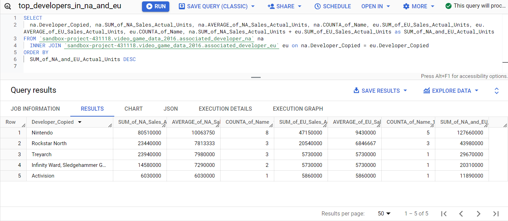
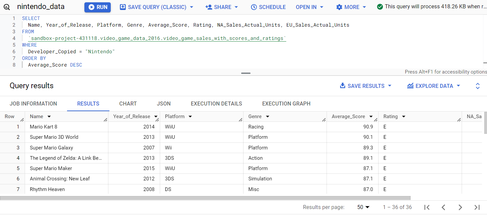

# Documentation and Changelog

Last Updated: October 2024

## Spreadsheets

The Spreadsheet Program being used to manipulate the data is Google Sheets. The Google Sheets document I used can be viewed [here](https://docs.google.com/spreadsheets/d/1BajKiLUhF1DZFFr2DQt4Ou9uBppsCPL-DVQhmIETFmo/edit?usp=sharing). All spreadsheet work was completed in this document by adding any new sheet as another tab in the file.

A copy of the Google Sheets file has also been downloaded as an Excel file that can be viewed [here](capstone_spreadsheets_sql_slideshow\video_game_sales_FINAL_241023.xlsx). Please note that since the Excel sheet is just a downloaded version of the Google Sheet **the charts/graphs in the Excel file are not formatted correctly**. I am familiar with Excel but I cannot currently fix these without a Microsoft subscription. Please see the [original Google Sheet](https://docs.google.com/spreadsheets/d/1BajKiLUhF1DZFFr2DQt4Ou9uBppsCPL-DVQhmIETFmo/edit?usp=sharing) to see the charts with the correct format.

## SQL

Used Google's BigQuery sandbox to run the SQL queries on the data. BigQuery queries can't be downloaded directly from the sandbox so copies of the used queries in SQL script files can be seen in the [sql folder](capstone_spreadsheets_sql_slideshow\sql).

## Slideshow

Used Google Slides to create a slideshow for this Capstone that can be viewed [here](https://docs.google.com/presentation/d/1E1vHoREJ3GviHgaH61mnQSr2RmdsqFd0v1ZLsB9K8eA/edit?usp=sharing) (**includes Speaker Notes**). A [PDF download of the slideshow](capstone_spreadsheets_sql_slideshow\Predicting_Popular_Video_Game_Releases_241023.pdf) is also saved in this project (does **not** include Speaker Notes).

### Changelog: Google Sheets (1/4)

- Created duplicate of data and converted from csv to google sheets file
- Sorted by _Year_of_Release_
- Some Games had blank _Developer_ columns, so created a _Developer_Copied_ column
  - If original _Developer_ column had a value, they were kept the same in the _Developer_Copied_ column
  - If _Developer_ was blank, the _Publisher_ column was copied to the _Developer_Copied_ column (e.g. Sega, Capcom).
- Created _Actual_Units_ columns to convert _Sales_ values from per Million to the actual number (e.g. _Global_Sales_ to _Global_Sales_Actual_Units_)
- Added Number formatting to _Actual_Units_ columns to include commas for readability #,###,###
- Added filter to _Year_of_Release_ to start in 2007
- _Imagine: Makeup Artist_ _Year_of_Release_ was incorrect (2020), so changed it to correct year (2008)
- Removed all records from before 2007, so that remaining data covered only 10 years 2007-2017
- Created **pivot tables** under _associated_platform_ tab to see units sold per platform
  - Saw there were 2 records that were blank
  - Filtered by Platform and deleted 2 rows containing empty records
  - Created pivot tables for units sold per platform for North America, Europe, Japan, and Other
  - Created **Donut charts** and **Bar charts** based off pivot tables
- Created **pivot tables** under _associated_developer_
  - Added filter to developer to only show greater than 5,000,000 units sold for Global, NA, EU, only show greater than 1,000,000 for JP and Other
  - Found the Average units sold per developer for each release
  - Downloaded csv files of _associated_developer_ pivot tables to be used later for **SQL** queries (in [data folder](data))
- Used **IFS statement** in Google Sheets to create _Average_Score_ column to find average rating between Critics and Users
  - User_score is on a 10.0 scale while critic is 100.0, so I converted user_score to be on 100.0 scale
  - (critic_score x critic_count + user_score x 10 x user_count)/(critic_count+user_count)
  - Formatted _Average_Score_ to show one decimal place
  - Created copy of spreadsheet and removed records with blank _Average_Score_ or _Rating_ because these are the metrics being used to determine popularity/likability
  - Downloaded as [video_game_sales_with_scores_and_ratings.csv](data\video_game_sales_with_scores_and_ratings.csv)

### Changelog: BigQuery (2/4)

- Loaded in datasets from downloaded CSV
  - [video_game_sales_with_scores_and_ratings.csv](data\video_game_sales_with_scores_and_ratings.csv) and all [associated_developer](data) csv files
- Used SQL query to join _Developer_Copied_ names that matched between NA and EU and made a table containing sum of both sales and sorted by highest sum
  - Determined Nintendo was highest rated
  - Decided to focus on NA and EU audiences for the sake of the scenario, to make join example

- Used SQL query to create a table for just Nintendo games from [video_game_sales_with_scores_and_ratings.csv](data\video_game_sales_with_scores_and_ratings.csv)
  - Created new column for _Total_Sales_NA_EU_
  - Included _Rating_ and sorted by _Average_Score_
  - Downloaded as [_nintendo_data_](data\nintendo_data.csv)

### Changelog: Google Sheets (3/4)

- Loaded [_nintendo_data_](data\nintendo_data.csv) into Google Sheets and froze header row
- Formatted NA_Sales_Actual_Units and EU_Sales_Actual_Units to include commas for readability #,###,###
- Created a Histogram for _Average_Score_ in _nintendo_scores_genre_and_ratings_ tab
- Used _Conditional Formatting_ to highlight _Total_Sales_NA_EU_ over 1,000,000 Units (statistic used in Slideshow later)
- Calculated Percentage of total sales for Nintendo games scoring over 80%
- Created **pivot tables** and **Pie charts** for _Rating_ and _Genre_

### Changelog: Google Slides (4/4)

- Selected template
- Created sections and added _Speaker Notes_
- Used **Embedded Charts**
  - All charts are linked to the ones created in the main [Google Sheets document](https://docs.google.com/spreadsheets/d/1BajKiLUhF1DZFFr2DQt4Ou9uBppsCPL-DVQhmIETFmo/edit?usp=sharing), so any changes made there will automatically be reflected in the slideshow
